## HORIZON BANKING APP PROJECT

## <a name="tech-stack">⚙️ Tech Stack</a>

- Next.js
- TypeScript
- Appwrite
- Plaid
- Dwolla
- React Hook Form
- Zod
- TailwindCSS
- Chart.js
- ShadCN

## <a name="features">🔋 Features</a>

👉 **Authentication**: An ultra-secure SSR authentication with proper validations and authorization

👉 **Connect Banks**: Integrates with Plaid for multiple bank account linking

👉 **Home Page**: Shows general overview of user account with total balance from all connected banks, recent transactions, money spent on different categories, etc

👉 **My Banks**: Check the complete list of all connected banks with respective balances, account details

👉 **Transaction History**: Includes pagination and filtering options for viewing transaction history of different banks

👉 **Real-time Updates**: Reflects changes across all relevant pages upon connecting new bank accounts.

👉 **Funds Transfer**: Allows users to transfer funds using Dwolla to other accounts with required fields and recipient bank ID.

👉 **Responsiveness**: Ensures the application adapts seamlessly to various screen sizes and devices, providing a consistent user experience across desktop, tablet, and mobile platforms.

and many more, including code architecture and reusability.

##

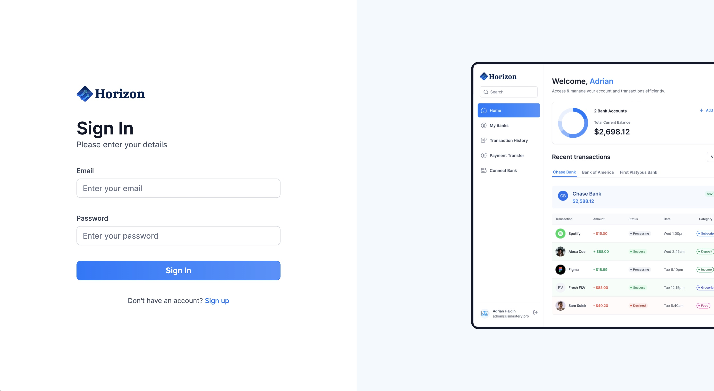
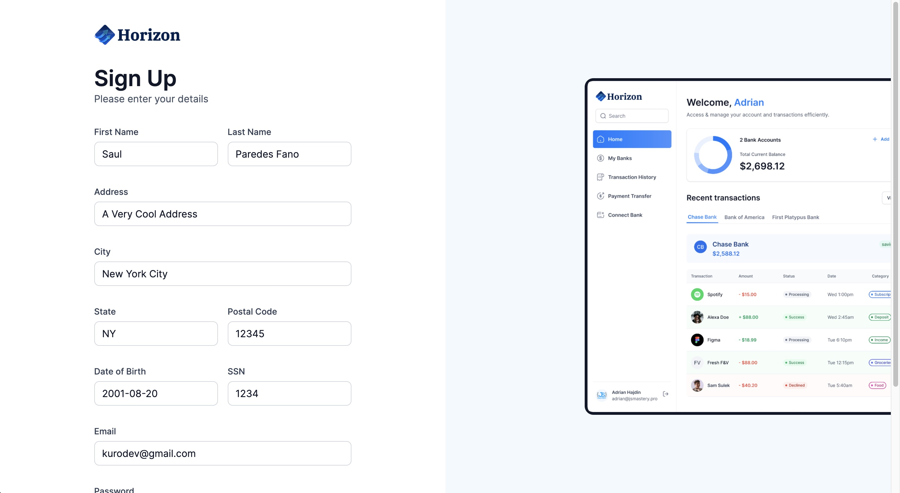
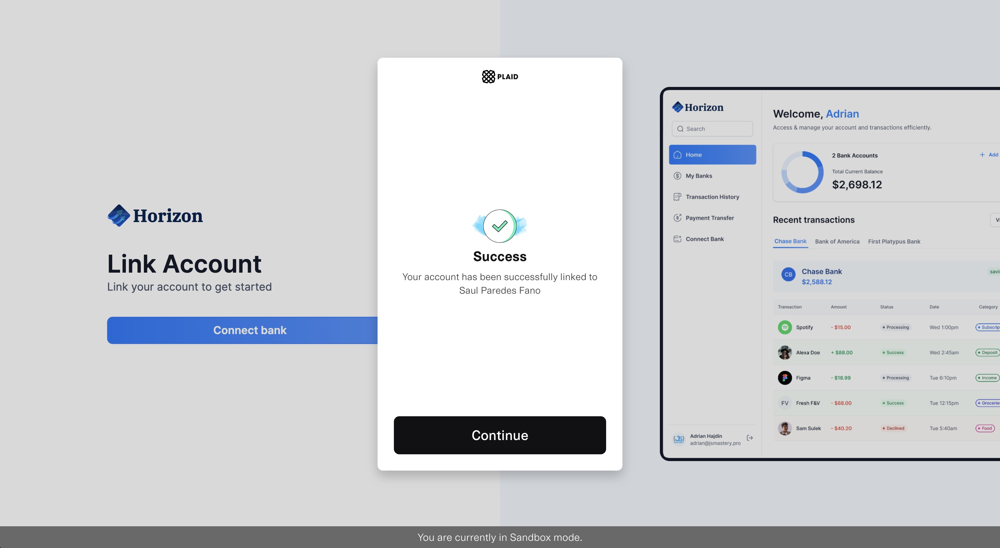
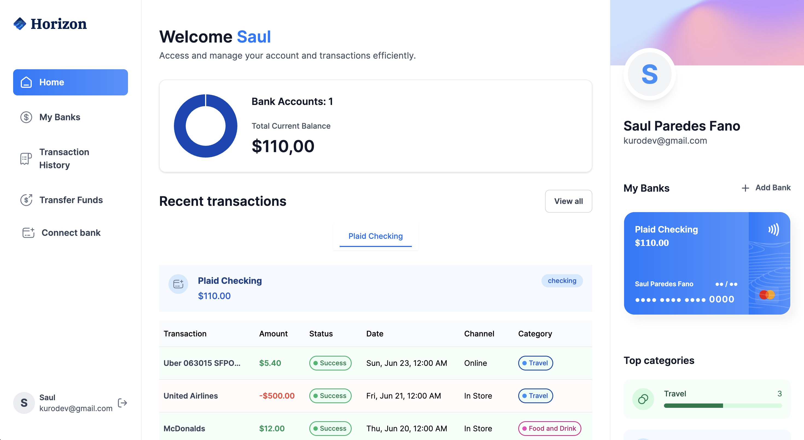
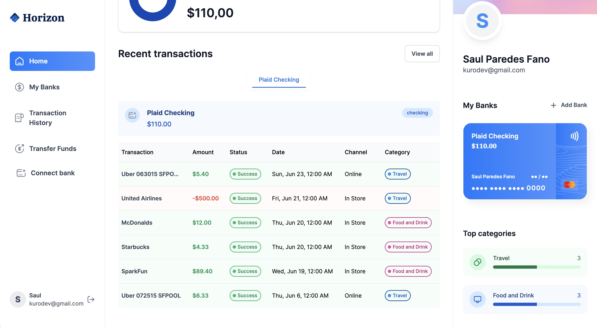
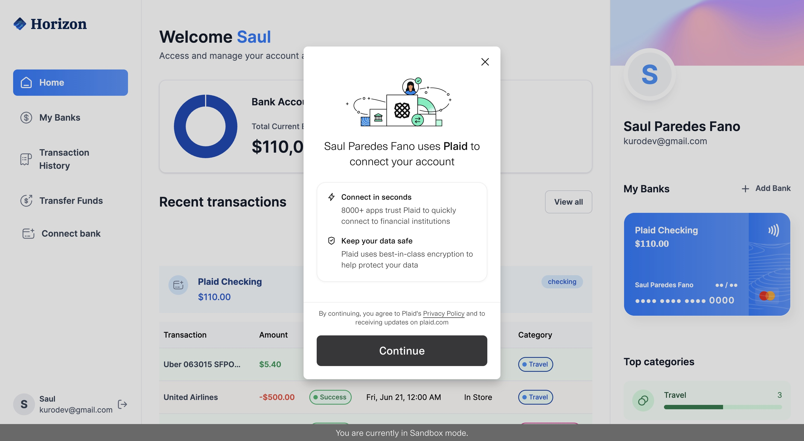
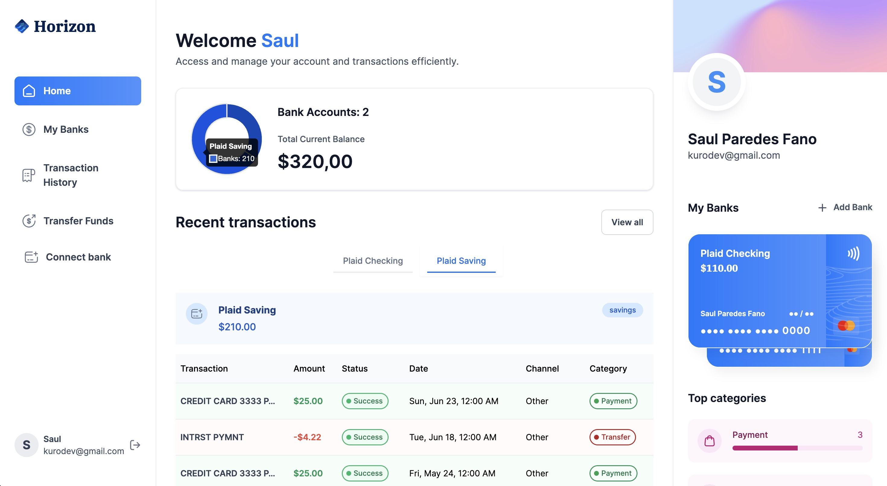
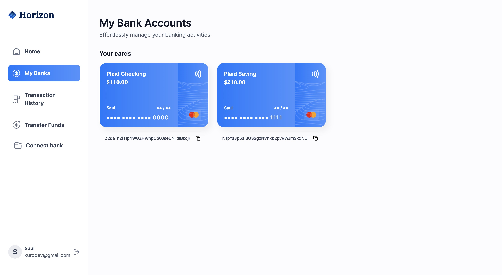
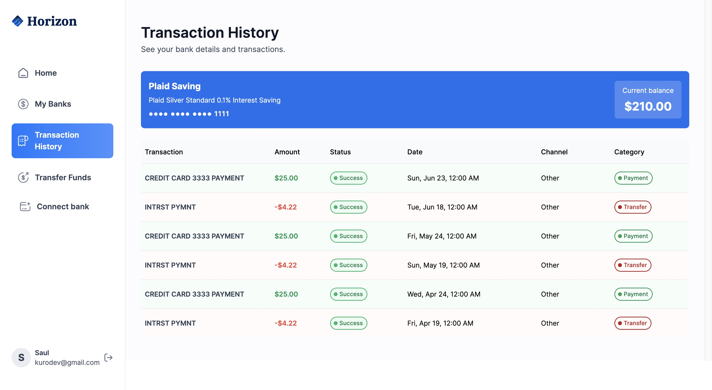
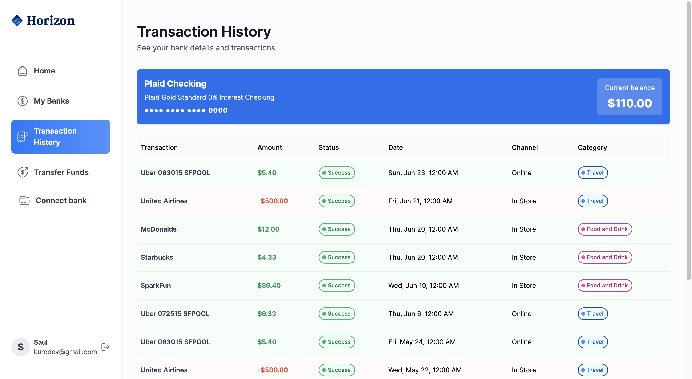
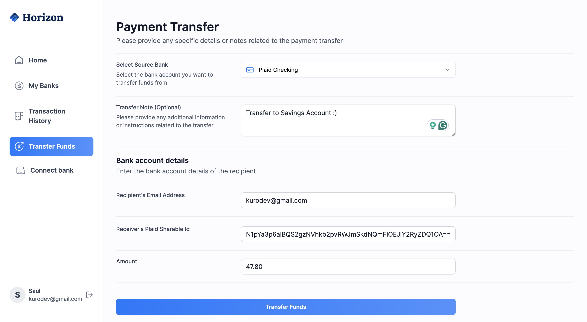
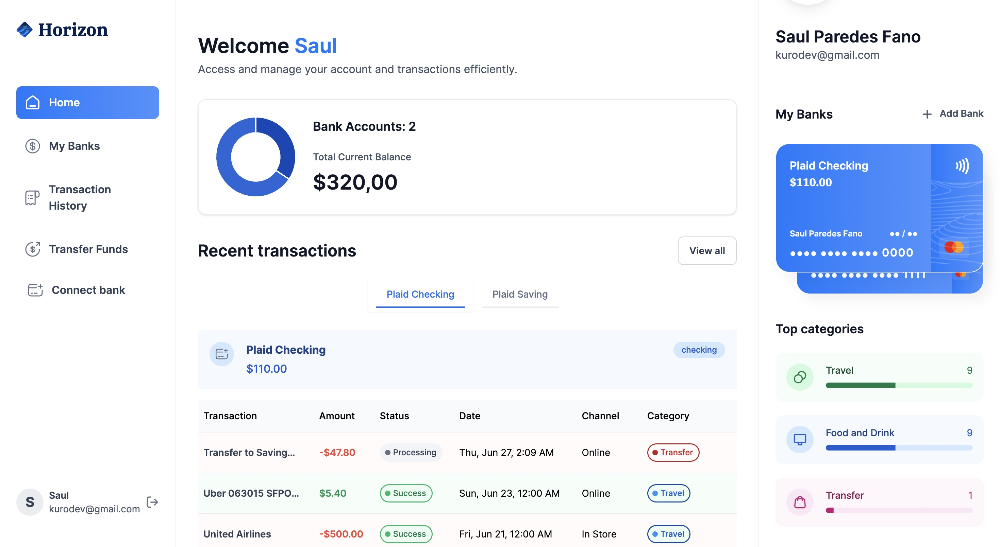
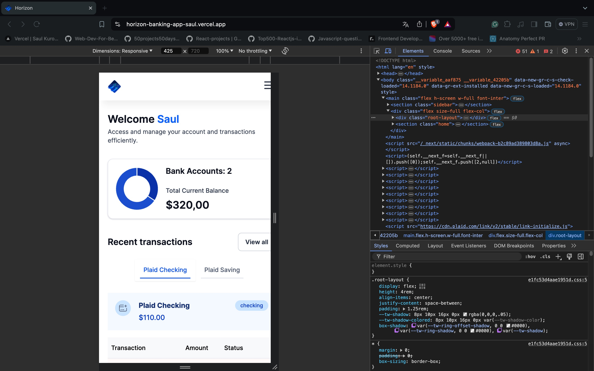
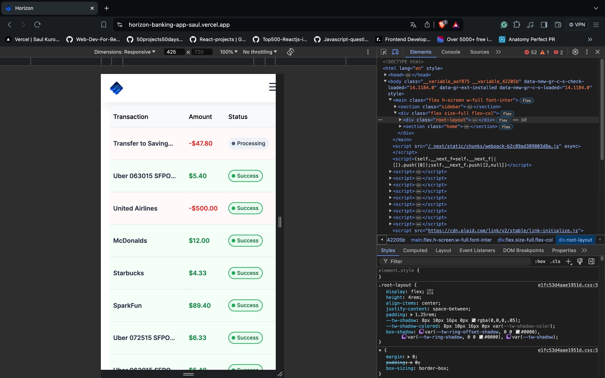
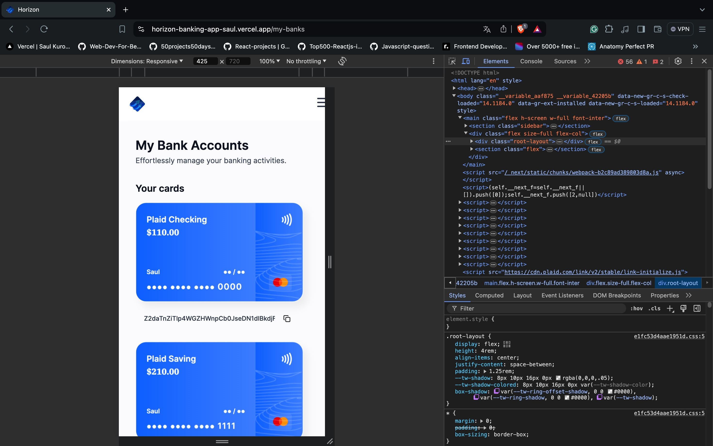
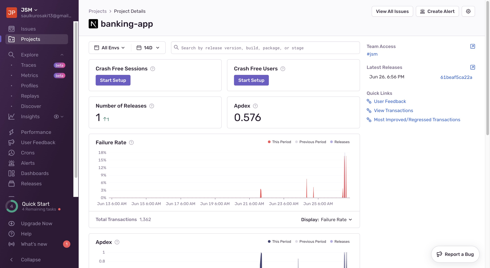
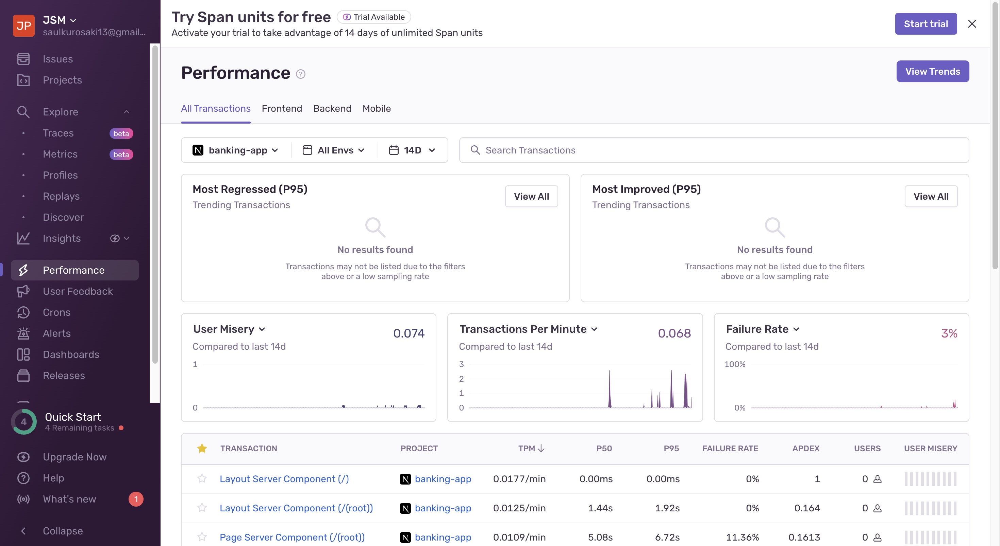
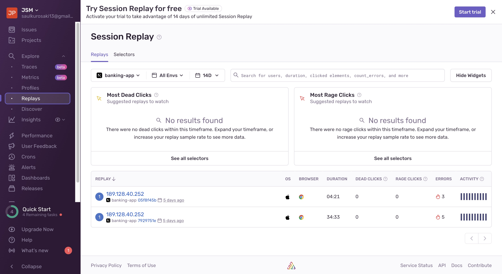
